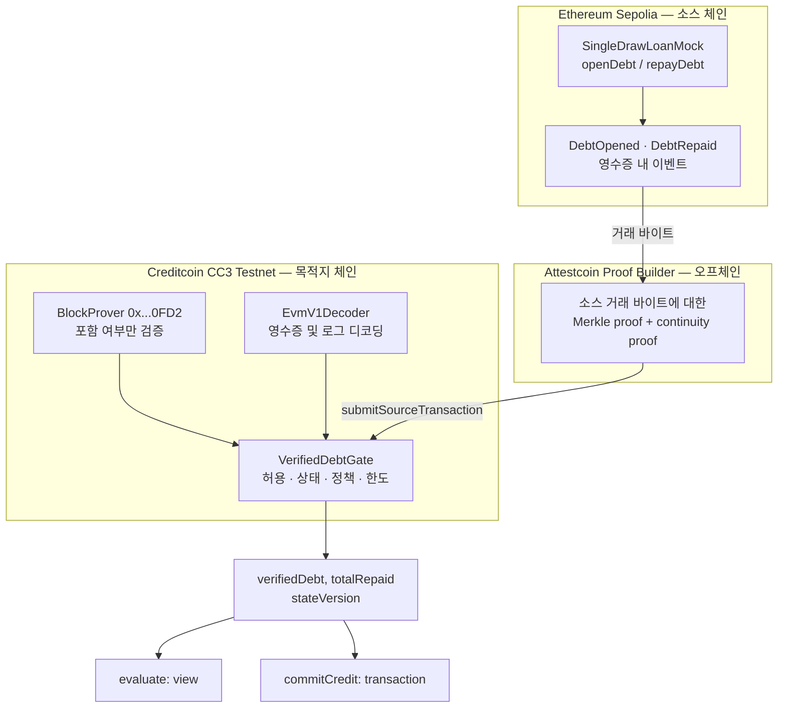
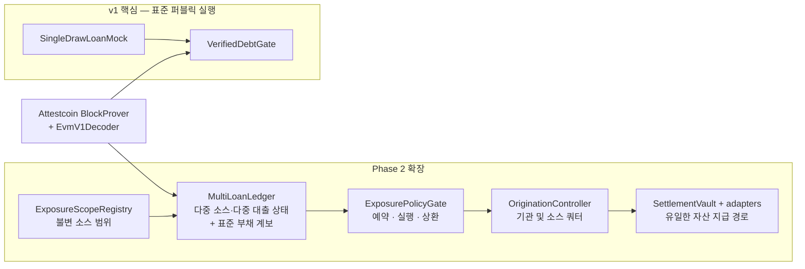
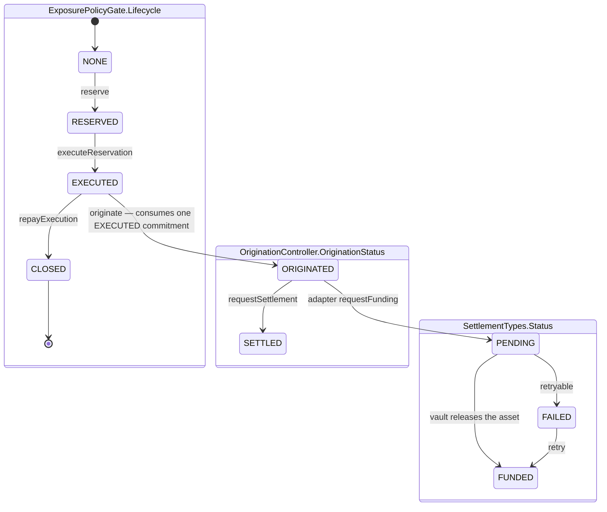
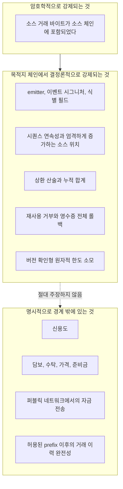
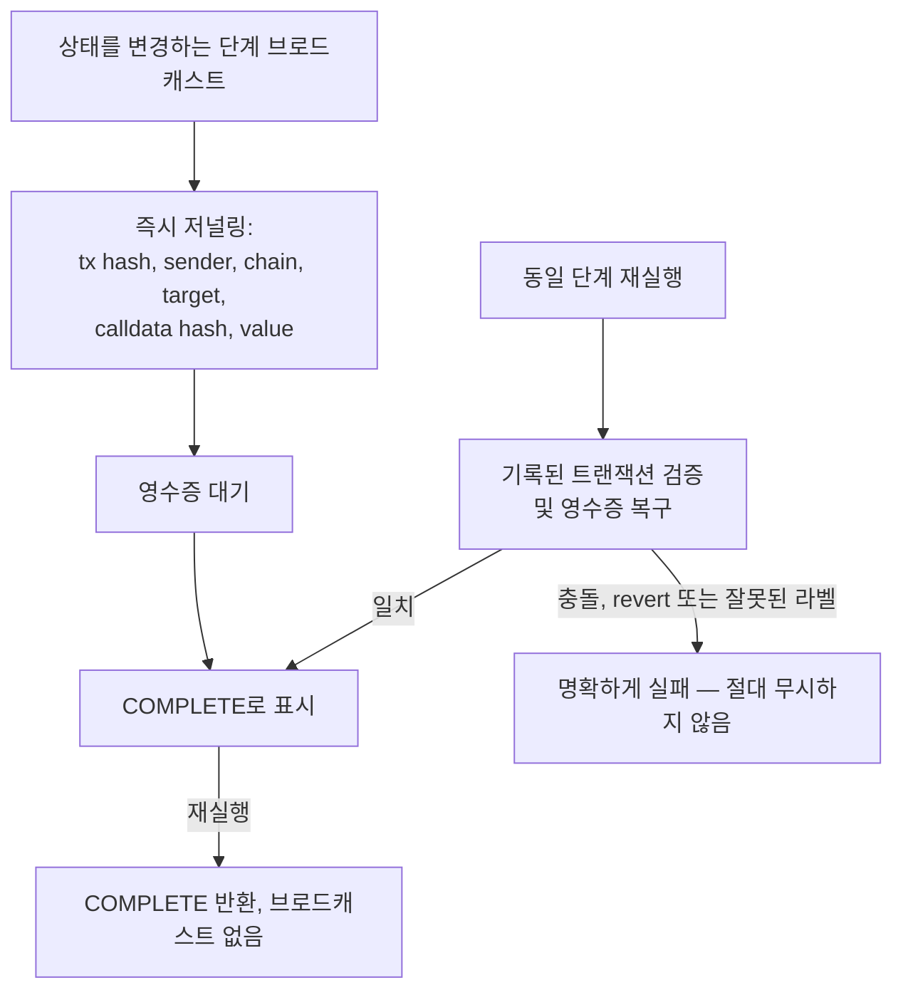

# Proof-to-Credit-Phase2

[English](README.md) | [한국어](README-ko.md)

[](https://github.com/tnwjd023-boop/Proof-to-Credit-Phase2/actions/workflows/ci.yml)

**검증된 외부 이벤트가 재구성된 금융 상태가 되고, 독립적인 정책이 이를 평가한 뒤, 제한된 한도를 원자적으로 소모한다.**

Proof-to-Credit은 이 하나의 좁은 파이프라인을 구현한 퍼블릭 테스트넷 기반 레퍼런스 구현체입니다. 대출자를 평가하거나, 담보 가격을 산정하거나, 자금을 이동시키지는 않습니다. 대신 더 구체적이고, 저희가 보기에 더 핵심적인 문제를 보여줍니다. 즉, **중개자가 해당 이벤트가 발생했다는 사실을 주장하는 것을 신뢰하지 않고도, 한 체인에서 이루어진 신용 의사결정을 다른 체인에서 실제로 발생한 것이 입증된 이벤트에 연결하는 방법**입니다.

- **소스 체인:** Ethereum Sepolia (`chainId 11155111`)
- **목적지 체인:** Creditcoin CC3 Testnet (`chainId 102031`)
- **증명 계층:** Attestcoin BlockProver (`0x...0FD2`), Creditcoin 프리컴파일
- **상태:** v1 경로와 Phase 2 다중 소스 회계 경로를 퍼블릭 테스트넷에서 실행 완료; 기관·개시(origination)·결제(settlement) 확장은 로컬 검증 상태

---

## 목차

- [이 프로젝트가 필요한 이유](#이-프로젝트가-필요한-이유)
- [입증되는 것과 입증되지 않는 것](#입증되는-것과-입증되지-않는-것)
- [표준 실행 흐름](#표준-실행-흐름)
- [시스템 아키텍처](#시스템-아키텍처)
- [컴포넌트 레퍼런스](#컴포넌트-레퍼런스)
- [허용 규칙과 폐쇄형 실패 동작](#허용-규칙과-폐쇄형-실패-동작)
- [Phase 2: 총 익스포저, 계보, 쿼터, 결제](#phase-2-총-익스포저-계보-쿼터-결제)
- [공개 증거](#공개-증거)
- [결과 재현하기](#결과-재현하기)
- [중단 안전성과 재개 가능성](#중단-안전성과-재개-가능성)
- [테스트, CI, 증거 수준](#테스트-ci-증거-수준)
- [저장소 구조](#저장소-구조)
- [보안 및 증거 경계](#보안-및-증거-경계)
- [범위와 로드맵](#범위와-로드맵)

---

## 이 프로젝트가 필요한 이유

### 문제

다른 곳에서 발생한 활동을 근거로 신용을 제공하려는 대출기관은 현재 세 가지 좋지 않은 선택지 중 하나를 택해야 합니다.

| 접근 방식 | 문제점 |
|---|---|
| **보고서를 신뢰한다.** 대출자 또는 대출자를 대신하는 플랫폼이 미상환 부채를 보고한다. | 대출기관이 심사하는 것은 사실이 아니라 주장이다. 사후에 감사할 수 있는 것은 결국 그 주장 자체뿐이다. |
| **오라클 또는 증명자를 신뢰한다.** 서명자가 목적지 체인에서 “부채는 30이다”라고 주장한다. | 서명 키가 실질적인 신용 권한이 된다. 키가 침해되면 이후의 모든 한도가 조용히 잘못된다. 거래상대방 위험을 키 위험으로 바꾼 것에 불과하다. |
| **자산을 이동시킨다.** 포지션을 브리지하거나 래핑하여 목적지 체인이 직접 보유하게 한다. | 수탁, 브리지 위험, 자산의 의미가 대출기관과 사실 사이에 끼어든다. 대출이 개시되거나, 상환이 이루어지거나, 배송이 완료되는 것처럼 실제 신용과 관련된 대부분의 이벤트는 애초에 이전 가능한 자산이 아니다. |

세 가지 방식 모두 같은 두 가지를 하나로 합쳐버립니다. 바로 **이벤트가 발생했다는 사실**과 **그 이벤트가 신용 측면에서 무엇을 의미하는지에 대한 해석**입니다. 이 둘이 합쳐지고 나면, 이후의 어떤 참여자도 데이터 오류와 정책 오류를 분리할 수 없습니다.

### 이 저장소가 대신 하는 일

Proof-to-Credit은 네 가지 관심사를 네 개의 독립적이고 각각 확인 가능한 계층으로 분리합니다.

| 계층 | 답하는 질문 | 답하는 주체 | 잘못되었을 때 |
|---|---|---|---|
| **Proof(증명)** | 정확히 이 거래 바이트가 소스 체인에 포함되었는가? | Attestcoin BlockProver가 암호학적으로 답한다 | 이후 어떤 계층도 이벤트를 허용하지 않는다 |
| **Interpretation(해석)** | 이 바이트에 우리가 인식하는 대출 이벤트가 포함되어 있고, 예상한 발행자(emitter)가 발생시켰으며, 올바른 순서인가? | 목적지 애플리케이션이 바이트로부터 결정론적으로 판단한다 | 이벤트가 revert되고 상태 잔여물이 남지 않는다 |
| **Policy(정책)** | 재구성된 상태를 기준으로 이 요청을 허용해야 하는가? | 목적지 정책 소유자가 읽기 전용 뷰에서 판단한다 | 결과가 과거 상태로 재현되며 누구나 다시 도출할 수 있다 |
| **Capacity(한도)** | 이 허용량이 실제로 소모되었는가? | 하나의 원자적이고 버전이 확인된 트랜잭션이 처리한다 | 동시 요청이 headroom을 이중으로 사용할 수 없다 |

이 설계가 지키는 원칙은 **어떤 계층도 다른 계층을 대신해서 말할 수 없다는 것**입니다. BlockProver는 포함 여부만 증명하며 신용도를 판단하지 않습니다. 애플리케이션은 디코딩하고 허용하지만 부채를 직접 설정할 수 없습니다. 이를 위한 관리자용 setter도 없습니다. 정책은 평가하지만 예약하지 않으며, `evaluate`는 `view`입니다. 한도를 변경하는 것은 `commitCredit`뿐이고, 이 함수는 앞선 평가를 신뢰하지 않고 모든 불변조건을 독립적으로 다시 확인합니다.

### 금융기관이 이 경계(seam)에 관심을 가져야 하는 이유

흥미로운 점은 숫자가 50에서 30으로 바뀌었다는 사실이 아닙니다. 핵심은 **소스 이벤트와 신용 한도 사이의 모든 단계가 각각 반증 가능하고, 어느 한 단계에서든 실패하면 바로 그 단계의 실패로 드러난다는 점**입니다.

- 대출기관은 누구에게도 묻지 않고 동일한 증명 바이트로 부채를 다시 계산할 수 있습니다.
- 변조된 증명은 정책 단계가 아니라 BlockProver에서 실패하며, 그 사실이 해당 단계의 실패로 관찰됩니다([런타임 증거](runs/20260906-t05/negative.json)).
- 잘못 구성되었거나 잘못 귀속된 이벤트는 허용 단계에서 실패하고 부분 상태를 남기지 않습니다.
- 오래된 headroom 뷰는 사용할 수 없습니다. 커밋에 해당 뷰가 계산된 상태 버전이 함께 포함되기 때문입니다.

이러한 경계가 있기 때문에 어떤 운영자도 신뢰하지 않는 제3자라도 이 파이프라인을 감사할 수 있습니다.

---

## 입증되는 것과 입증되지 않는 것

이 절은 데모보다 앞에 의도적으로 배치되어 있습니다. 전체 등록부는 [`docs/CLAIMS.md`](docs/CLAIMS.md)에 있으며, [`docs/TEST_MATRIX.md`](docs/TEST_MATRIX.md)는 사례별 증거 수준을 구분합니다.

### 입증되는 것

| 주장 | 수준 | 증거 |
|---|---|---|
| 전체 proof → state → policy → capacity 경로가 퍼블릭 테스트넷에서 실행된다 | **VERIFIED** | 표준 매니페스트에 기록된 T12 Sepolia 및 CC3 트랜잭션 |
| 증명에서 도출된 부채가 한도 계산의 입력값이다 | **VERIFIED** | 표준 게이트에서 debt50과 debt30에 대해 과거에 실행된 `evaluate` 호출 |
| BlockProver가 런타임에서 변조된 증명 입력을 거부한다 | **VERIFIED** (CC3 블록 `5439094`에서 `eth_call`) | 두 증명 모두에서 Merkle root, 거래 바이트, 연속성 변조를 거부 |
| 경쟁 커밋이 하나의 관측된 headroom을 재사용할 수 없다 | **REJECTED** (공격 실패) | 첫 번째 커밋이 `stateVersion`을 증가시키고, 두 번째 커밋은 `StaleStateVersion`으로 revert |
| 완료된 단계가 재시도 시 트랜잭션을 다시 전송한다 | **FALSE** (그렇지 않다) | 저널링된 단계는 `COMPLETE`를 반환하거나 영수증으로 복구 |
| 오래된 저장 증명을 실시간 확인 없이 브로드캐스트할 수 있다 | **FALSE** (할 수 없다) | 서명자를 생성하기 전에 BlockProver를 통한 사전 확인 수행 |

### 주장하지 않는 것

| 주장 | 수준 |
|---|---|
| Attestcoin이 신용도를 증명한다 | **FALSE.** 거래 바이트의 포함만 증명한다. 그 이상은 증명하지 않는다. |
| 실물 금, 소유권, 수탁, 담보권 또는 준비금이 검증된다 | **FALSE / 범위 밖.** `assetId`는 데모용 라벨이다. |
| 가격 또는 담보 가치가 정책에 반영된다 | **FALSE.** `headroom = max(creditLimit − verifiedDebt − committedCredit, 0)`이다. 가격 항은 존재하지 않는다. |
| `commitCredit`이 대출, 자금 이체 또는 결제를 수행한다 | **FALSE.** 회계상 커밋일 뿐이다. |
| 재구성된 상태가 완전하거나 항상 최신이다 | **FALSE / 범위 밖.** 단일 인출 대출 하나에 대한 이벤트 기반 prefix다. |
| REJECT가 지속적인 온체인 의사결정 기록이다 | **FALSE.** `evaluate`는 뷰 함수다. 결과는 재현할 수 있지만 거절 로그는 존재하지 않는다. |
| 게이트가 소스 EVM 체인 ID를 독립적으로 강제한다 | **FALSE.** `sourceEvmChainId`는 저장되지만 허용 판단에는 사용되지 않는다. 출처는 Attestcoin의 `chainKey=1`, BlockProver, 불변 emitter를 통해 확보된다. |
| Settlement vault의 지급이 실제 퍼블릭 전송이다 | **FALSE / 로컬 전용.** Vault, escrow, LayerZero 테스트는 로컬 VM mock을 사용한다. |
| KGLD 통합이 되어 있다 | **FALSE / 범위 밖.** 업계 참고 사례일 뿐이다. |

**왜 이렇게 많은 부정형 주장을 명시하는가?** 이 영역에서는 범위가 한정되지 않은 주장이 범위가 명확한 주장보다 가치가 낮기 때문입니다. 증거가 정확히 어디에서 멈추는지 볼 수 있는 검토자는 그 경계 안에 있는 내용을 신뢰할 수 있습니다.

---

## 표준 실행 흐름

하나의 실행만으로도 상태 전이를 구체적으로 확인할 수 있습니다. 모든 값은 하나의 소수점 이하 6자리 회계 단위인 `DEMO_USD_6`을 사용합니다.

```text
Ethereum Sepolia                                      Creditcoin CC3 Testnet

DebtOpened(50)  -- Attestcoin proof -->  verifiedDebt = 50
                                            50 debt + 30 request > 60 limit
                                            REJECT · headroom 10

DebtRepaid(20)  -- Attestcoin proof -->  verifiedDebt = 30
                                            30 debt + 30 request = 60 limit
                                            ALLOW  · headroom 30

                                         commitCredit(30)
                                            committedCredit = 30
                                            headroom = 0
                                            next request 1 → REJECT
```

### 동일한 실행을 네 개의 전이로 표현

| # | 검증 또는 재구성된 사실 | 독립적인 목적지 결과 | 기록 유형 |
|---|---|---|---|
| 1 | 오프닝 증명 허용 → `verifiedDebt = 50` | 요청 `30`, 한도 `60` → **REJECT**, headroom `10`, utilization `80` | 뷰 결과 |
| 2 | 상환 증명 허용 → 20 상환, `verifiedDebt = 30` | 요청 `30`, 한도 `60` → **ALLOW**, headroom `30`, utilization `60` | 뷰 결과 |
| 3 | 사실은 `verifiedDebt = 30`으로 변하지 않음 | `commitCredit(30)` → `committedCredit = 30`, headroom `0`, `stateVersion 2 → 3` | **온체인 트랜잭션** |
| 4 | 부채 `30` + 커밋 `30` = 한도 `60` | 다음 요청 `1` → **REJECT**, utilization `60,000,001` | 뷰 결과 |

한도를 변경하는 기록은 전이 3뿐입니다. 이 전이는 자금을 이동시키지 않습니다. 전이 1, 2, 4는 지속적인 승인 또는 거절 로그가 아니라 재현 가능한 `evaluate` 뷰 결과입니다.

각 `stateHash`를 포함한 전체 의사결정 스냅샷은 [표준 실행 매니페스트](runs/20260906-t05/manifest.json)에 있습니다.

---

## 시스템 아키텍처

### 엔드투엔드 흐름



이 다이어그램에서 가장 중요한 세부사항은 **BlockProver와 디코더가 동일한 바이트를 입력으로 받는다는 것**입니다. 증명은 해당 바이트가 Sepolia에 포함되었음을 입증하고, 디코더는 그 바이트에서 영수증, emitter, 토픽, 데이터를 독립적으로 추출합니다. 애플리케이션은 외부 주체가 디코딩한 요약값을 절대 받아들이지 않습니다.

### 각 계층이 할 수 있는 일



`VerifiedDebtGate`(v1)와 `MultiLoanLedger`(Phase 2)는 동일한 증명 및 디코딩 계층을 병렬로 사용하는 소비자입니다. Phase 2는 표준 v1 실행을 수정하거나 대체하지 않습니다. v1 컨트랙트와 해당 매니페스트는 변경 없이 보존됩니다.

### Phase 2 퍼블릭 다중 소스 실행

별도 실행 [`runs/phase2-20260913-multisource-01/manifest.json`](runs/phase2-20260913-multisource-01/manifest.json)은 서로 다른 두 `SealedLoanSource` 컨트랙트와 서로 다른 데모 부채를 사용한 **Sepolia → Attestcoin → CC3 Testnet** 공개 실증입니다. 실제 소스 이벤트와 체크포인트 증명, CC3 `MultiLoanLedger` 제출, epoch 1·2 스냅샷, B 상환, 20 단위 예약, 누락·재생·변조·오래된 버전·한도 초과에 대한 읽기 전용 거부 검사를 포함합니다. 최종 읽기 전용 감사 결과는 [`runs/phase2-20260913-multisource-01/audit.json`](runs/phase2-20260913-multisource-01/audit.json)에 있으며, 거래 25개·증명 번들 8개·과거 호출 9개를 확인했고 감사 중 새 거래는 0개였습니다.

이 실행에서 퍼블릭 검증된 범위는 **두 소스 회계 및 증명 경로**입니다. 독립 기관, 여러 소스 체인, 실제 자산 전송, LayerZero 결제, 운영용 origination은 입증하지 않습니다. 소스 B 배포 코드는 퍼블릭 CC3 RPC가 배포 블록의 과거 상태를 보존하지 않아 최신 상태에서 확인했으며, 해당 fallback은 감사 결과에 명시되어 있습니다.

### 한도 생명주기

`ExposurePolicyGate.Lifecycle`은 `{ NONE, RESERVED, EXECUTED, CLOSED }`입니다. 개시(origination)와 결제(settlement)는 자체 상태 열거형을 가진 별도 컨트랙트에서 추적합니다.



| 전이 | 강제되는 연결 조건 |
|---|---|
| `reserve` | 원장 상태 버전, 정책 버전, 범위 버전, 스냅샷 ID를 모두 **하나의** 트랜잭션에 포함 |
| `executeReservation` | 승인된 실행자, 정확한 커밋 금액, 상태 버전, 일회성 증명 참조 |
| `repayExecution` | 실행된 금액을 상한으로 사용; `CLOSED`는 종료 상태 |
| `originate` | 정확한 금액에 대한 `EXECUTED` 커밋, 등록된 소스 키, 일회성 증명 참조, 세 개의 쿼터 원장을 원자적으로 갱신 |
| vault `fund` | 정확한 자산, 정확한 수령인, 정확한 금액, 사용되지 않은 origination ID — 멱등적 처리 |

예약된 익스포저와 실행된 익스포저는 **모두** 이용률에 포함됩니다. 따라서 둘 사이의 전환은 한도를 만들거나 없애지 않습니다. 결제 상태는 실행된 익스포저와 별도로 추적합니다. 두 항목이 절대로 이중 집계되지 않도록 하기 위해서입니다.

### 신뢰 경계



---

## 컴포넌트 레퍼런스

### 소스 체인

| 컨트랙트 | 역할 |
|---|---|
| [`contracts/source/SingleDrawLoanMock.sol`](contracts/source/SingleDrawLoanMock.sol) | 의도적으로 최소화한 대출 컨트랙트. 한 번 `openDebt`한 뒤 `repayDebt`만 가능하다. `assetId`, `unitId`, `borrower`, 파생된 `loanId`는 불변이다. `DebtOpened`와 `DebtRepaid` 두 이벤트만 발생시킨다. 토큰은 전송하지 않는다. |

**왜 single-draw가 단순화가 아니라 안전 제약인가.** 상환 증거가 늦게 도착하면 목적지는 부채를 *과대 계상*할 수 있을 뿐이며, 이는 보수적인 방향입니다. 반면 보이지 않는 *신규 인출*은 부채를 과소 계상하게 만듭니다. 안전하지 않은 방향을 위협 모델에서 완전히 제거하기 위해 소스를 단일 인출로 제한합니다.

### 증명과 디코딩

| 컴포넌트 | 역할 |
|---|---|
| Attestcoin **BlockProver** `0x0000000000000000000000000000000000000FD2` | 제공된 소스 거래 바이트에 대해 Merkle proof와 continuity proof를 검증한다. `verify`, `verifyAndEmit`, `calculateTxIndex`를 제공한다. Sepolia는 EVM chain ID가 아니라 Attestcoin의 `chainKey=1`이다. |
| Attestcoin **ChainInfo** `0x0000000000000000000000000000000000000FD3` | 지원되는 소스 경로의 체인 메타데이터를 제공한다. |
| [`contracts/vendor/EvmV1Decoder.sol`](contracts/vendor/EvmV1Decoder.sol) | `@gluwa/usc-contracts@0.1.2`(MIT)에서 vendoring한 디코더. raw 바이트에서 거래 유형, 영수증 필드, 로그를 디코딩한다. 배포 크기 `10,272`바이트; 코드 해시 `0x6af1caad...68dc38d`. |
| [`contracts/interfaces/`](contracts/interfaces) | 애플리케이션이 의존하는 두 외부 경계인 `INativeQueryVerifier`와 `IEvmDecoder`를 정의한다. |

### 목적지 — v1 핵심

| 컨트랙트 | 역할 |
|---|---|
| [`contracts/cc3/VerifiedDebtGate.sol`](contracts/cc3/VerifiedDebtGate.sol) | v1 목적지 전체. 허용, 상태 재구성, 정책, 한도를 하나의 감사 가능한 컨트랙트에서 처리한다. |
| [`contracts/cc3/SourcePosition.sol`](contracts/cc3/SourcePosition.sol) | 엄격한 `(blockNumber, txIndex, logIndex)` 순서를 관리한다. |

`VerifiedDebtGate` 한눈에 보기:

| 함수 | 종류 | 동작 |
|---|---|---|
| `submitSourceTransaction(chainKey, height, encodedTx, merkleProof, continuityProof)` | write | BlockProver를 통해 검증하고, 영수증을 디코딩하며, 일치하는 로그를 허용하고, 부채를 재구성한다 |
| `evaluate(requestedCredit)` | **view** | `allowed`, `Reason`, `observedHeadroom`, `proposedUtilization`, `stateHash`, `stateVersion`, `policyVersion`을 반환한다 |
| `setPolicy(newCreditLimit)` | write | 불변 `policyOwner`만 호출 가능; `policyVersion`을 증가시킨다 |
| `commitCredit(amount, expectedStateVersion, expectedPolicyVersion)` | write | 한도를 변경하는 유일한 호출. 차입자 권한, 초기화 여부, 두 버전, 양수 여부, headroom을 독립적으로 다시 확인한다 |
| `stateHash()` / `getState()` | view | 감사 가능한 상태 커밋과 전체 상태를 조회한다 |

`Reason`은 `{ ALLOW, UNINITIALIZED, ZERO_AMOUNT, OVER_LIMIT }`입니다. 초기화 전 headroom은 설정된 한도가 아니라 sentinel 값인 `0`입니다. 검증 근거가 없는 한도를 컨트랙트가 암시하지 않도록 하기 위해서입니다.

식별 정보를 구성하는 모든 값은 생성자에서 불변으로 설정됩니다. 검증자, 디코더, 소스 체인 키, 소스 emitter, 자산, 대출, 단위, 차입자, 정책 소유자, 초기 한도가 이에 해당합니다. **관리자에 의한 검증자 교체 기능도 없고, 부채를 직접 설정하는 setter도 없습니다.**

### 목적지 — Phase 2

| 컨트랙트 | 역할 |
|---|---|
| [`ExposureScopeRegistry.sol`](contracts/aggregate/ExposureScopeRegistry.sol) | 필수 소스의 불변 집합. 체인 키, emitter, 어댑터 버전, 매핑 버전, 단위, 유효 epoch을 포함한다. 새로운 범위는 새 배포를 필요로 한다. |
| [`SealedLoanSource.sol`](contracts/aggregate/SealedLoanSource.sol) | 다중 대출 데모 소스. `seal()` 전에는 `openLoan`만 가능하고, `repay`는 항상 가능하다. `checkpoint()`은 대출/이벤트 수, rolling history root, 누적 산술값을 발생시킨다. |
| [`MultiLoanLedger.sol`](contracts/aggregate/MultiLoanLedger.sol) | 소스와 대출 전반의 증명 기반 재구성, 체크포인트 대조, 표준 부채 계보를 처리하며 `finalizeSnapshot(epoch)`을 제공한다. |
| [`ExposurePolicyGate.sol`](contracts/aggregate/ExposurePolicyGate.sol) | `evaluate`, `reserve`, `executeReservation`, `repayExecution`을 제공한다. 사유는 `{ ALLOW, OVER_LIMIT, COVERAGE_INCOMPLETE, SNAPSHOT_STALE, LINEAGE_UNRESOLVED, ZERO_AMOUNT }`이다. |
| [`OriginationController.sol`](contracts/aggregate/OriginationController.sol) | 기관 권한, pair·소스 전체·기관 전체 쿼터, 커밋별 1회 origination을 관리한다. |
| [`settlement/SettlementVault.sol`](contracts/settlement/SettlementVault.sol) | 설정된 ERC-20 또는 네이티브 자산을 지급하는 **유일한** 컴포넌트. 정확한 금액과 수령인에 묶여 있으며 멱등적으로 동작한다. 최초 할당 이후 어댑터 권한은 잠긴다. |
| [`settlement/DirectSettlementAdapter.sol`](contracts/settlement/DirectSettlementAdapter.sol) | 재시도 가능한 명시적 `FAILED` 상태를 가진 목적지 escrow 경로를 제공한다. |
| [`settlement/LayerZeroSettlementOApp.sol`](contracts/settlement/LayerZeroSettlementOApp.sol) | 선택적 크로스체인 전송 기능. endpoint, EID, peer는 명시적인 배포 입력값이며, 활성화하기 전에 대상 네트워크에 맞는지 확인해야 한다. |

---

## 허용 규칙과 폐쇄형 실패 동작

증명 제출은 **모든** 조건이 충족될 때만 허용됩니다. 하나라도 실패하면 영수증 전체가 revert되며 부분 적용은 없습니다.

| # | 검사 | 실패 동작 |
|---|---|---|
| 1 | 제공된 chain key가 불변 소스 chain key와 같은가 | `WrongSourceChain` |
| 2 | BlockProver가 Merkle proof와 continuity proof를 검증하는가 | `InvalidProof` |
| 3 | 해당 쿼리가 이전에 처리된 적이 없는가 | `AlreadyProcessed` |
| 4 | 디코딩된 영수증 상태가 `1`인가 | revert, 잔여 상태 없음 |
| 5 | 로그가 불변 emitter와 알려진 이벤트 시그니처에 일치하는가 | `NoApplicableLog` |
| 6 | 자산, 대출, 단위, 차입자 식별자가 일치하는가 | revert, 잔여 상태 없음 |
| 7 | 소스 위치 `(block, txIndex, logIndex)`가 엄격하게 증가하는가 | `OutOfOrderSourcePosition` |
| 8 | 시퀀스가 정확히 다음에 예상된 값인가 | `InvalidSequence` |
| 9 | 오프닝이 모든 상환보다 앞서는가 | `MissingOpening` |
| 10 | 상환 산술이 누적값과 미상환값을 일치시키는가 | `InvalidRepayment` |
| 11 | 소스 타임스탬프가 후퇴하지 않는가 | revert, 잔여 상태 없음 |
| 12 | 하나의 영수증에 일치하는 로그가 중복으로 존재하는가 | **배치 전체 롤백** |

한도 소모에는 별도의 독립적인 검사가 추가됩니다. 호출자가 불변 차입자인지, 상태가 초기화되었는지, `expectedStateVersion`과 `expectedPolicyVersion`이 모두 일치하는지, 금액이 양수인지, 금액이 현재 headroom에 들어가는지를 확인합니다. 극단적으로 큰 `uint256` 원금은 평가 단계에서 panic을 일으키고 커밋을 거부합니다. 즉, 한도를 초과 할당하지 않고 폐쇄형으로 실패합니다.

Phase 2에는 범위 수준의 폐쇄형 실패 조건이 추가됩니다. 소스 체크포인트 누락(대출이 0건인 소스 포함), 오래된 스냅샷, 시퀀스 공백, 해결되지 않은 alias, 경쟁 상태 버전이 있으면 모두 예약이 차단됩니다. 스냅샷 유효성은 증명 제출 시간이 아니라 **가장 오래된** 소스 타임스탬프를 기준으로 제한됩니다. 따라서 지연된 소스를 최신 제출로 감출 수 없습니다.

---

## Phase 2: 총 익스포저, 계보, 쿼터, 결제

v1은 “한 대출의 검증된 부채는 얼마인가?”에 답합니다. Phase 2는 실제 대출기관이 묻는 질문에 답합니다. **“고려해야 할 모든 소스에 걸쳐 이 차입자의 검증된 총 익스포저는 얼마이며, 남은 한도를 기준으로 안전하게 커밋할 수 있는가?”**

### A–C · 총 익스포저

총 익스포저에서 어려운 부분은 잔액을 더하는 일이 아닙니다. **누락된 것이 없다는 사실을 증명하는 것**입니다.

- 범위 구성원, 식별자, 어댑터 버전은 **불변**입니다. 새로운 범위는 새 배포와 재수집을 의미합니다.
- 등록된 **모든** 소스는 요청된 epoch에 대한 체크포인트를 제출해야 합니다. 대출이 0건인 소스도 포함됩니다. 커버리지는 전부 충족되거나 전부 실패합니다.
- 체크포인트는 소스가 생성한 카운트와 rolling history root를 커밋하고, `MultiLoanLedger`는 이를 자체 재구성 결과와 대조합니다. 소스가 이벤트를 조용히 누락할 수 없습니다.
- `finalizeSnapshot(epoch)`은 범위, epoch, 원장 버전, 각 소스 체크포인트 위치를 기반으로 snapshot ID를 계산하고, 가장 이른 체크포인트 타임스탬프와 불변 TTL을 기록합니다.
- `reserve`는 원장 상태, 정책, 범위 버전, snapshot ID를 **하나의 트랜잭션**에 연결합니다. 이후 원장이 업데이트되면 모든 체크포인트가 다시 일치할 때까지 스냅샷이 무효화됩니다.

> 범위는 연결된 부채-한도 풀입니다. 이것은 모든 부채가 하나의 차입자에게 속한다는 주장도 아니고, 규제상 EAD 계산이라는 주장도 아닙니다.

### D · 표준 부채 계보

토큰화되거나 래핑된 부채 표현이 두 번째 부채로 집계되어서는 안 됩니다. 반대로 관계없는 부채가 기존 부채에 조용히 합쳐져서도 안 됩니다. 원장은 검증된 alias를 고정된 표준 부채 ID에 `REPRESENTS` 또는 `WRAPS` 관계로 매핑합니다. 이 등록은 최초 수집 전에 이루어져야 하며 이후에는 불변입니다. 등록 시 차입자, 대출기관, 자산, 단위, 원금이 일치해야 하고, 표현 간 미상환액은 증가하지 않아야 합니다. 소스별 체크포인트 산술은 독립적으로 유지하며, 표준 부채의 고유 총액은 표준화된 감소분에 대해서 한 번만 차감합니다.

### E · 예약 생명주기

권한이 있는 실행자가 하나의 커밋을 `RESERVED`에서 `EXECUTED`로 원자적으로 이동시키며, 참조된 상환 증명을 적용할 수도 있습니다. 예약 금액과 실행 금액은 모두 이용률에 반영되므로 전환은 한도에 중립적입니다. 증명 참조의 재사용은 거부되며, `CLOSED`는 종결 상태입니다.

> 여기의 불투명한 proof ID는 **증거 연결(evidence binding)**일 뿐, 공개 Attestcoin 검증 결과가 아닙니다. 소스 측 상환 경로는 원장을 통해 계속 증명 기반으로 처리됩니다.

### F · 기관 origination 통제

새로운 origination은 정확한 금액에 해당하는 `EXECUTED` 게이트 커밋을 소모하고, 불변 범위에 등록된 소스 키를 사용하며, 한 번만 사용할 수 있는 proof reference를 제시해야 합니다. pair, 소스 전체, 기관 전체 쿼터가 원자적으로 강제됩니다. 이미 origination된 금액보다 쿼터를 낮추는 것은 거부됩니다. 각 커밋은 한 번만 origination할 수 있습니다.

> 게이트/레지스트리 pair마다 표준 `OriginationController`를 **하나만 배포**하고, 그 주소를 배포 설정의 일부로 취급해야 합니다. 사용량과 쿼터 원장은 컨트롤러별로 분리되어 있기 때문입니다.

### 결제

`SettlementVault`는 자산을 지급하는 유일한 컴포넌트이며, 정확한 자산·정확한 수령인·정확한 금액·사용되지 않은 origination ID를 확인해 멱등적으로 지급합니다. 어댑터 권한은 한 번 할당되면 잠깁니다. `DirectSettlementAdapter`는 재시도 가능한 `FAILED` 상태를 가진 목적지 escrow 경로를 제공하고, `LayerZeroSettlementOApp`은 설정된 peer와 EID에서 온 메시지만 허용하는 선택적 크로스체인 전송을 제공합니다.

> **로컬 mock만 사용합니다.** 결제 테스트 스위트는 mock endpoint와 mock token을 사용합니다. 이 저장소는 퍼블릭 LayerZero 실행, 자산 배포, peer 설정 또는 vault 자금 공급을 주장하지 않습니다.

---

## 공개 증거

표준 테스트넷 차입자 및 실행 서명자 — **테스트넷 전용**: `0x122409763443d94060fAc61676d50c0B1006f49F`

### 트랜잭션

| 증거 | 네트워크 | 트랜잭션 |
|---|---|---|
| `DebtOpened(50)` | Ethereum Sepolia | `0xa5c0954a0b148e84d37c68a87fc9d37d77c548f1aed4d522ee0c9009f92042cd` |
| `DebtRepaid(20)` | Ethereum Sepolia | `0x326c666d0208e6f1625396a559cb78bb4e7783c56eda52c11643e7339cba0687` |
| 오프닝 증명 허용 | Creditcoin CC3 | `0xf6587f667a069b272c9650e6dfdaf577c0b020ece3c200b8da85e2e5df890ebd` |
| 상환 증명 허용 | Creditcoin CC3 | `0xe13a4974cb8c79b5c81163081991b3a6e0823f4c4b382f0ef8ae8ab25e8dbcc0` |
| `commitCredit(30)` | Creditcoin CC3 | `0xcf3d79a7d50c87dfc860bd067da91357c8bc695b5b48fb035cefa4571e3dbb20` |

### 배포

| 컴포넌트 | 네트워크 | 주소 |
|---|---|---|
| `SingleDrawLoanMock` | Sepolia | `0x0c93759f8eC91B348D8C53EA03C1ae78ED543760` |
| `EvmV1Decoder` (표준) | CC3 | `0x8006e5fdE6AC19A86D8bAe018191e2b12a3eB01E` |
| **`VerifiedDebtGate` (표준, T12)** | CC3 | **`0xC97b7EA6de5fc4Cb39D7Fc52881B3d98f4b68147`** |

> 매니페스트의 이전 `destination` (`0xf2BB...14Fa`) 및 `destinationT09` (`0x9c3b...7A51`) 항목은 **과거 배포**입니다. 이전 빌드에 대한 불변 증거일 뿐, 표준 게이트의 별칭이 아니며 최종 코드가 들어 있지도 않습니다.

### 증거 파일

| 파일 | 내용 |
|---|---|
| [`runs/20260906-t05/manifest.json`](runs/20260906-t05/manifest.json) | 표준 실행 기록. 모든 배포, 트랜잭션, 코드 해시, 상태 스냅샷, 의사결정을 포함한다. |
| [`runs/20260906-t05/proofs/`](runs/20260906-t05/proofs) | 저장된 오프닝 및 상환 증명 번들 |
| [`runs/20260906-t05/negative.json`](runs/20260906-t05/negative.json) | CC3 블록 `5439094`에서 수집한 읽기 전용 런타임 부정 증거 |
| [`runs/probe/`](runs/probe) | 상태, 지연, 변조 통제를 포함한 읽기 전용 Attestcoin 기준선 probe |
| [`runs/t15-recovery-check/manifest.json`](runs/t15-recovery-check/manifest.json) | 이미 공개된 트랜잭션 5건을 **새로운 브로드캐스트 없이** 영수증으로 복구한 기록. 두 번째 금융 실행이 아니라 복구 테스트다. |

### 읽기 전용 데모 UI

공개된 UI는 **[tnwjd023-boop.github.io/Proof-to-Credit/ui/](https://tnwjd023-boop.github.io/Proof-to-Credit/ui/)**에 있습니다. 기존 표준 증거를 시각화할 뿐입니다. 서명하거나 브로드캐스트하지 않으며, 자격 증명·지갑·서명자 입력 화면도 없습니다. 이 속성은 [테스트로 확인](test/ui.test.js)됩니다.

로컬에서 실행하려면:

```powershell
npm run ui
```

총 익스포저 A–C 화면은 `/ui/aggregate.html`에 있습니다. 이 화면은 별도로 내보낸 JSON 상태 보고서를 읽습니다. 보고서에는 소스별 잔액, 필수 소스 커버리지, 체크포인트 위치, 스냅샷 최신성, 총부채, 예약, 정책 결정이 포함됩니다.

```powershell
AGGREGATE_RPC_URL=<url> npm run aggregate:status -- <gate-address> [request-raw-units]
```

보고서는 특정 시점의 읽기 전용 증거입니다. 내보내기 도구는 수집 후 블록 해시를 다시 읽고, 재구성이 발생하면 하나의 높이에 대한 서로 다른 버전을 섞지 않고 중단합니다.

---

## 결과 재현하기

### 요구사항

- **Node.js 22 이상**
- Sepolia ETH와 CC3 테스트넷 CTC — 새로 서명하는 실행에서만 필요
- **테스트넷 전용 지갑**. 메인넷 또는 실제 가치가 있는 자산을 보유한 지갑은 절대 사용하지 마십시오.

`.env.example`을 `.env`로 복사합니다. `WALLET_ADDRESS`와 `PRIVATE_KEY`는 서명이 필요한 명령에서만 필요합니다. `.env*`는 `.env.example`을 제외하고 git에서 무시됩니다.

스크립트는 Sepolia `11155111`과 CC3 `102031` 이외의 chain ID를 거부합니다. **메인넷 실행은 지원하지 않습니다.**

### 1 · 로컬 검증 — 키와 네트워크 쓰기 없음

```powershell
npm install
npm run compile   # 테스트 전에 필수: 스위트가 실제 컴파일된 바이트코드를 로드함
npm test
```

예상 결과: **140개 테스트 통과.** 테스트 스위트는 실제 컴파일된 바이트코드를 EthereumJS VM에 배포하므로, 먼저 `npm run compile`을 실행해야 합니다. 그렇지 않으면 VM 기반 테스트가 모두 `Missing artifacts` 오류로 실패합니다.

### 2 · 표준 퍼블릭 실행 재감사 — 읽기 전용, 서명자 없음

```powershell
node scripts/resume.js --run 20260906-t05 --slot destinationT12
```

이 명령은 기록된 영수증 8개, 배포된 코드 해시, 최신 `verifiedDebt`와 `committedCredit`을 퍼블릭 RPC를 통해 다시 확인합니다.

예상 결과: `verifiedDebt=30000000`, `committedCredit=30000000`, 상태 `COMPLETE`.

RPC 연결이 필요합니다. **이 명령은 서명자를 만들지 않으며 개인 키를 사용하거나 출력하지 않습니다.**

### 3 · 새로 재현 가능한 실행 — 테스트넷 자금 필요

새 run ID를 선택합니다. 기존 ID를 재사용해도 매니페스트를 덮어쓰지 않습니다. 완료된 단계는 `COMPLETE`를 반환하고, 저널에 기록되었으나 완료되지 않은 단계는 영수증 복구 절차로 진입합니다.

```powershell
$runId = "YYYYMMDD-demo1"
$slot = "destinationDemo1"

node scripts/check-env.js
node scripts/deploy-source.js  --run $runId
node scripts/source-actions.js open  --run $runId --amount 50
node scripts/source-actions.js repay --run $runId --amount 20
node scripts/fetch-proof.js    --run $runId --tx <openingTxHash>
node scripts/fetch-proof.js    --run $runId --tx <repaymentTxHash>
node scripts/deploy-cc3.js     --run $runId --slot $slot
node scripts/submit-proof.js   --run $runId --slot $slot --proof debt-opened
node scripts/submit-proof.js   --run $runId --slot $slot --proof debt-repaid
node scripts/demo.js           --run $runId --slot $slot --mode testnet
node scripts/resume.js         --run $runId --slot $slot
```

두 개의 해시 placeholder를 소스 액션 명령이 출력한 해시로 바꿉니다. **소스 블록이 증명 가능한 상태가 될 때까지 증명 생성이 지연될 수 있습니다.** 기준선 probe에서는 약 34블록의 지연이 관찰되었으며, 블록 시간이 12초일 때 약 6.8분에 해당합니다.

이 시나리오는 하나의 회계 단위를 사용합니다. 50을 개시하고, 20을 상환하여, 재구성된 부채 30, 정책 한도 60, 커밋 30을 만듭니다. 이는 데모 회계값이며 토큰 전송이나 금의 수량이 아닙니다.

---

## 중단 안전성과 재개 가능성

충돌을 견디지 못하는 퍼블릭 테스트넷 실행은 재현 가능한 증거가 아닙니다. 이 설계는 중단을 예외가 아니라 정상적인 상황으로 취급합니다.



저널링은 **브로드캐스트 직후, 영수증을 기다리기 전에** 이루어집니다. 이 구간에서 충돌이 발생하면 트랜잭션의 정체성을 잃을 수 있습니다. 이 방식은 소스 배포 및 액션, 디코더와 게이트 배포, 증명 제출, `commitCredit`을 모두 포괄합니다.

언제든지 실행 상태를 확인할 수 있습니다.

```powershell
node scripts/resume.js --run <runId> --slot <destinationSlot>
```

이 명령은 읽기 전용 네트워크 검사를 수행하고 다음 미완료 명령을 출력합니다. **서명하지 않으며, 대체 트랜잭션을 조용히 제출하지도 않습니다.**

브로드캐스트 후 pending 기록이 작성되기 전에 프로세스가 종료된 경우, 알고 있는 해시와 종류를 함께 제공합니다. 지원되는 종류는 `source-deploy`, `source-open`, `source-repay`, `decoder-deploy`, `gate-deploy`, `debt-opened`, `debt-repaid`, `commit-credit`입니다.

```powershell
node scripts/resume.js --run <runId> --slot <destinationSlot> --tx <txHash> --kind debt-opened
```

검사기는 올바른 체인을 선택하고 sender, target, zero value, 정확한 배포 또는 함수 calldata를 확인한 뒤 해당 트랜잭션을 pending으로 기록합니다. revert되었거나, 잘못 라벨링되었거나, 충돌하는 트랜잭션은 **무시하지 않습니다.**

### 증명 최신성

`submit-proof.js`는 서명자를 생성하기 **전에** 저장된 번들을 **실시간** BlockProver와 대조합니다. 연속성 데이터가 오래된 경우 동일한 불변 소스 트랜잭션을 **정확히 한 번** 새로 조회하고, 정상 동작 및 변조 통제를 다시 실행한 뒤에만 브로드캐스트를 허용합니다. 새로 고침은 증명 가능성 데이터만 바꾸며 소스 식별자나 재사용 의미론은 바꾸지 않습니다.

---

## 테스트, CI, 증거 수준

```powershell
npm run compile && npm test
```

**32개 스위트 파일에서 140개 테스트.** CI는 `main`에 push될 때마다, 그리고 모든 pull request마다 `npm ci → npm run compile → npm test`를 실행합니다.

테스트는 파일 구조가 아니라 검증하려는 경계를 기준으로 구성되어 있습니다.

| 영역 | 스위트 |
|---|---|
| 허용, 순서, 시퀀스, 상환 | `admission`, `sequence`, `repayment`, `source` |
| 정책과 원자적 커밋 | `policy`, `commitment`, `scenario` |
| 애플리케이션 보안 매트릭스 | `security` — 8개 공격 그룹 |
| 실제 Sepolia 바이트에 대한 디코더 | `decoder`, `proof-client` |
| 총 익스포저 A–C | `aggregate`, `aggregate-security`, `aggregate-view` |
| 계보와 생명주기 D–E | `aggregate-de` |
| Origination과 쿼터 F | `aggregate-f`, `origination-settlement` |
| 결제 | `settlement`, `settlement-vault`, `settlement-config`, `direct-settlement`, `layerzero-settlement` |
| 실행 도구와 증거 무결성 | `resume`, `cc3-run`, `source-run`, `health`, `wallet-env`, `ui`, `ci-workflow` |

### 증거 수준

검토자에게 가장 중요한 구분은 다음과 같습니다.

| 수준 | 입증하는 것 | 위치 |
|---|---|---|
| **로컬 애플리케이션** | 영수증 디코딩, 허용, 순서, 산술, 롤백, 정책, 커밋 | EthereumJS VM 스위트 |
| **실제 영수증 바이트** | vendored 디코더가 저장된 Sepolia 거래 envelope을 처리한다는 것 | `decoder.test.js`, 저장된 proof bundle |
| **실제 BlockProver** | 유효한 증명을 런타임에서 허용하고 root·byte·continuity 변조를 거부한다는 것 | `runs/20260906-t05/negative.json` |
| **실제 CC3 저장 상태** | 증명 제출이 표준 게이트를 변경하고 커밋이 한도를 소모했다는 것 | T12 트랜잭션과 매니페스트 |

`TestOnlyVerifierMock(true)`는 애플리케이션 검사를 분리해 확인하기 위해 의도적으로 `true`를 반환합니다. **Merkle 포함 여부나 연속성을 전혀 입증하지 않습니다.** 그 결과를 증명 판정으로 표현하지도 않습니다. 합성 영수증 테스트는 Attestcoin이 변조된 바이트를 받아들였다고 주장하지 않습니다. 로컬 VM 증거 역시 퍼블릭 Attestcoin 실행으로 제시하지 않습니다.

---

## 저장소 구조

```
contracts/
  source/        Sepolia 대출 — SingleDrawLoanMock
  cc3/           v1 목적지 — VerifiedDebtGate, SourcePosition
  aggregate/     범위 레지스트리, sealed source, 원장, 익스포저 게이트, origination
  settlement/    Vault, 어댑터 인터페이스, direct escrow, LayerZero OApp
  interfaces/    INativeQueryVerifier, IEvmDecoder
  vendor/        EvmV1Decoder — @gluwa/usc-contracts에서 vendoring, MIT
scripts/         배포, 증명 조회 및 제출, 데모, 재개, 상태 내보내기
src/             Proof client, 증거 기록기, 실행/결과 모델, aggregate view
test/            32개 스위트 파일 — test/helpers의 VM harness, test/fixtures의 실제 fixture
ui/              읽기 전용 증거 뷰어 및 aggregate status view
runs/            퍼블릭 실행 매니페스트, proof bundle, 부정 증거, probe 증거
docs/            SPEC, CLAIMS, TEST_MATRIX, 기준선, PROGRESS, 설계 계획
```

### 문서 안내

| 문서 | 읽어야 할 내용 |
|---|---|
| [`docs/SUBMISSION.md`](docs/SUBMISSION.md) | 간결한 프로젝트 서사 |
| [`docs/SPEC.md`](docs/SPEC.md) | 고정된 MVP 범위, 식별자, 컴파일러 기준선 |
| [`docs/CLAIMS.md`](docs/CLAIMS.md) | **모든 주장과 그 증거 수준 및 한계** |
| [`docs/TEST_MATRIX.md`](docs/TEST_MATRIX.md) | 로컬·런타임·퍼블릭 증거의 사례별 구분 |
| [`docs/ATTESTCOIN_BASELINE.md`](docs/ATTESTCOIN_BASELINE.md) | 관찰된 지연을 포함한 읽기 전용 증명 계층 측정값 |
| [`docs/DECODER_BASELINE.md`](docs/DECODER_BASELINE.md) | 컴파일러 설정, 코드 해시, 실제 fixture 디코딩 |
| [`docs/SOURCE_BASELINE.md`](docs/SOURCE_BASELINE.md) | 소스 변조 지점과 부정 동작 |
| [`docs/DESTINATION_BASELINE.md`](docs/DESTINATION_BASELINE.md) | T07 → T09 → T12 배포 이력 |
| [`docs/PROGRESS.md`](docs/PROGRESS.md) | T01부터 T15까지의 작업별 기록 |
| [`docs/superpowers/`](docs/superpowers) | Phase 2 구현 계획과 결제 설계 |

### 빌드 기준선

| 필드 | 값 |
|---|---|
| solc | `0.8.36+commit.8a079791` |
| viaIR | `true` |
| optimizer | 활성화, runs `200` |
| EVM target | `paris` |
| Node.js | `>= 22` |

---

## 보안 및 증거 경계

### 실행 증거에 포함될 수 있는 것

주소, 트랜잭션 해시, 증명 바이트, 영수증, 상태, 타임스탬프.

### 절대 포함해서는 안 되는 것

`.env` 내용, 개인 키, mnemonic, faucet 자격 증명, 관련 없는 지갑 데이터. 증거 기록기는 정규화된 자격 증명 필드명, 자격 증명이 포함된 URL, 일반적인 환경변수 형식의 비밀값 할당을 적극적으로 거부합니다. **그러나 이것은 일반적인 비밀정보 스캐너가 아니라 안전장치입니다.** 검토를 대신하는 기능으로 의존하지 마십시오.

매니페스트는 원자적으로 작성되며, 최초 생성은 배타적으로 수행되고 기존 매니페스트를 덮어쓰지 않습니다.

### 운영상 주의사항

- 표준 실행에서는 하나의 EOA가 소스 차입자, 목적지 차입자, 정책 소유자 역할을 모두 수행합니다. 실행 영역은 코드상 분리되어 있지만, **서로 독립적인 기관은 입증되지 않았습니다.**
- `sourceEvmChainId`는 설명용 메타데이터일 뿐 허용 검사가 아닙니다.
- `evaluate` 결과는 뷰입니다. REJECT는 과거 상태로 재현할 수 있지만 지속적인 거절 기록은 아닙니다.
- LayerZero endpoint, EID, peer 값은 명시적인 배포 입력값이며 해당 경로를 활성화하기 전에 **대상 CC3 네트워크에 맞는지 반드시 확인해야 합니다.**
- 게이트/레지스트리 pair마다 표준 `OriginationController`를 하나만 배포해야 합니다. 해당 컨트롤러의 원장은 컨트롤러별로 분리됩니다.

---

## 범위와 로드맵

### 범위에 포함되며 완료된 것

증명으로 검증된 소스 이벤트 → 재구성된 대출 상태 → 독립적인 목적지 정책 → 원자적이고 제한된 한도 소모. 이 경로를 퍼블릭 테스트넷에서 실행했으며, 총 익스포저, 표준 계보, 예약 생명주기, 기관 쿼터, 결제 경계를 로컬에서 검증했습니다.

### 명시적으로 범위에서 제외된 것

실제 대출 또는 자금 전송, 금 준비금·권리·수탁, 담보 가치평가, 이자, 추가 인출 또는 재개시, 컨트랙트 업그레이드, 메인넷 쓰기, KGLD 프로덕션 통합.

### 다음 단계의 통합에 필요한 것

| 마일스톤 | 필요한 것 |
|---|---|
| 퍼블릭 총 익스포저 증거 | 각 소스에 대한 실제 Attestcoin 증명을 사용하여 CC3에 scope registry, ledger, exposure gate 배포 |
| 실제 결제 | 배포된 자산, 자금이 공급된 vault, 검증된 LayerZero endpoint/EID/peer 값, 퍼블릭 자금 공급 영수증 |
| 독립적인 기관 | 실제 조직별로 분리된 차입자, 정책 소유자, 할당자, 실행자, 기관 키 |
| 소스 어댑터 | 불투명한 proof reference가 아니라 검증된 소스 이벤트를 origination에서 사용하도록 소스별 Attestcoin 어댑터 구축 |

---

*Proof-to-Credit은 프로토타입입니다. proof → state → policy → capacity를 보여주는 것이며, 대출 상품을 보여주는 것이 아닙니다. 이 문서의 모든 주장은 [`docs/CLAIMS.md`](docs/CLAIMS.md)에 정의된 범위로 제한됩니다.*
