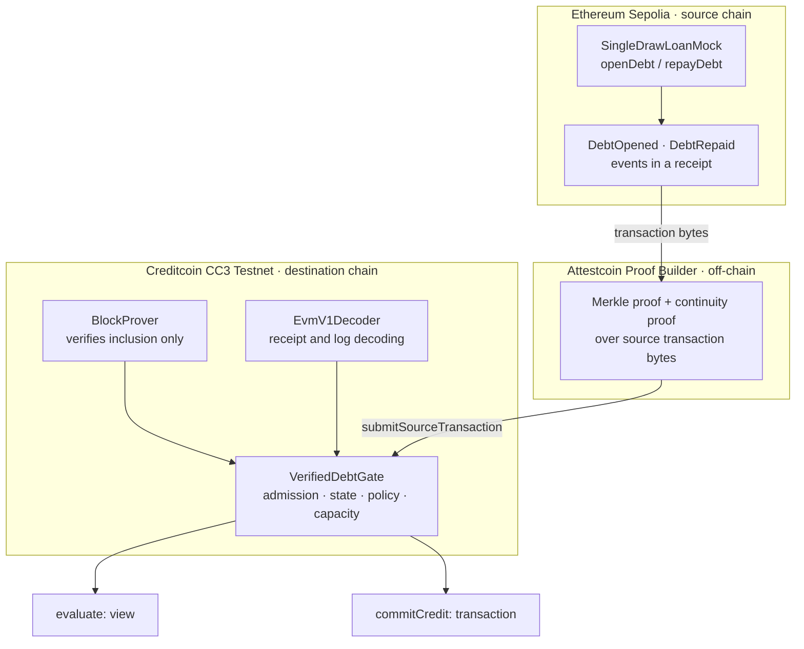
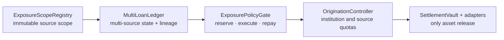

# Proof-to-Credit-Phase2

[English](README.md) | [한국어](README-ko.md)

[](https://github.com/tnwjd023-boop/Proof-to-Credit-Phase2/actions/workflows/ci.yml)

**A verified external event becomes reconstructed financial state, which an independent policy evaluates, which atomically consumes bounded capacity.**

Proof-to-Credit is a public-testnet reference implementation of that narrow pipeline. It does not score borrowers, price collateral, or move money. It demonstrates how a credit decision on one chain can be bound to an event that provably happened on another chain, without either side trusting an intermediary's assertion about that event.

- **Source chain:** Ethereum Sepolia (`chainId 11155111`)
- **Destination chain:** Creditcoin CC3 Testnet (`chainId 102031`)
- **Proof layer:** Attestcoin BlockProver (`0x0000000000000000000000000000000000000FD2`), a Creditcoin precompile
- **Status:** v1 path and the Phase 2 two-source accounting path executed on public testnets; institution, origination, and settlement extensions remain locally verified

---

## Table of contents

- [Why this exists](#why-this-exists)
- [What is proven, and what is not](#what-is-proven-and-what-is-not)
- [The canonical run](#the-canonical-run)
- [System architecture](#system-architecture)
- [Component reference](#component-reference)
- [Admission rules and fail-closed behavior](#admission-rules-and-fail-closed-behavior)
- [Phase 2: aggregate exposure, lineage, quotas, settlement](#phase-2-aggregate-exposure-lineage-quotas-settlement)
- [Public evidence](#public-evidence)
- [Reproducing the results](#reproducing-the-results)
- [Interruption safety and resumability](#interruption-safety-and-resumability)
- [Testing, CI, and evidence levels](#testing-ci-and-evidence-levels)
- [Repository layout](#repository-layout)
- [Security and evidence boundary](#security-and-evidence-boundary)
- [Scope and roadmap](#scope-and-roadmap)

---

## Why this exists

### The problem

A lender who wants to extend credit against activity that happened somewhere else has three bad options today.

| Approach | What goes wrong |
|---|---|
| **Trust a report.** The borrower, or a platform acting for them, states their outstanding debt. | The lender is underwriting a claim, not a fact. |
| **Trust an oracle or attestor.** A signer asserts “debt is 30” on the destination chain. | The signing key becomes the real credit authority. |
| **Move the asset.** Bridge or wrap the position so the destination chain holds it directly. | Custody, bridge risk, and asset semantics sit between the lender and the fact. |

All three collapse two separate questions into one: whether an event occurred, and what that event means for credit. Proof-to-Credit keeps those concerns independently checkable.

### What this repository does instead

| Layer | Question it answers | Who answers it | If it is wrong |
|---|---|---|---|
| **Proof** | Were these exact transaction bytes included in the source chain? | Attestcoin BlockProver | Nothing downstream admits the event |
| **Interpretation** | Do these bytes contain a recognised event from the expected emitter and sequence? | Destination application | The event reverts; no state residue |
| **Policy** | Given reconstructed state, should this request be allowed? | Destination policy owner | The result is reproducible from historical state |
| **Capacity** | Has the allowance actually been consumed? | One atomic, version-checked transaction | Concurrent requests cannot double-spend headroom |

BlockProver proves inclusion and nothing else. The application decodes and admits events but has no administrative debt setter. `evaluate` is a view. Only `commitCredit` changes v1 capacity, and it independently re-checks its invariants.

## What is proven, and what is not

The full register is [`docs/CLAIMS.md`](docs/CLAIMS.md); [`docs/TEST_MATRIX.md`](docs/TEST_MATRIX.md) separates local, runtime, and public evidence.

### Proven

| Claim | Level | Evidence |
|---|---|---|
| The v1 proof → state → policy → capacity path runs on public testnets | **VERIFIED** | T12 Sepolia and CC3 transactions in the canonical manifest |
| Proof-derived debt is an input to the limit calculation | **VERIFIED** | Historical `evaluate` calls at debt 50 and debt 30 |
| BlockProver rejects mutated proof inputs at runtime | **VERIFIED** | Root, transaction-byte, and continuity mutations rejected at CC3 block `5439094` |
| Competing commitments cannot reuse one observed headroom | **REJECTED** (the attack fails) | The second request reverts `StaleStateVersion` |
| A completed step is sent again on retry | **FALSE** | Journaled steps return `COMPLETE` or recover by receipt |
| A stale saved proof can be broadcast without a live check | **FALSE** | BlockProver preflight runs before signer construction |

### Not claimed

| Claim | Level |
|---|---|
| Attestcoin proves creditworthiness | **FALSE.** It proves transaction-byte inclusion. |
| Physical gold, ownership, custody, collateral rights, or reserves are verified | **FALSE / OUT OF SCOPE.** `assetId` is a demo label. |
| Price or collateral value enters the policy | **FALSE.** `headroom = max(creditLimit − verifiedDebt − committedCredit, 0)`. |
| `commitCredit` lends, transfers, or settles funds | **FALSE.** It is an accounting commitment. |
| Reconstructed state is complete or always current | **FALSE / OUT OF SCOPE.** It is an event-derived prefix. |
| A REJECT is a persistent on-chain decision record | **FALSE.** `evaluate` is a view. |
| The gate independently enforces the source EVM chain ID | **FALSE.** Provenance comes from Attestcoin `chainKey=1`, BlockProver, and the immutable emitter. |
| Settlement vault payments are real public transfers | **FALSE / LOCAL ONLY.** Vault, escrow, and LayerZero tests use local mocks. |
| KGLD integration | **FALSE / OUT OF SCOPE.** Industry reference only. |

## The canonical run

All values use the six-decimal accounting unit `DEMO_USD_6`.

```text
Ethereum Sepolia                                      Creditcoin CC3 Testnet

DebtOpened(50)  -- Attestcoin proof -->  verifiedDebt = 50
                                            50 debt + 30 request > 60 limit
                                            REJECT · headroom 10

DebtRepaid(20)  -- Attestcoin proof -->  verifiedDebt = 30
                                            30 debt + 30 request = 60 limit
                                            ALLOW · headroom 30

                                         commitCredit(30)
                                            committedCredit = 30
                                            headroom = 0
                                            next request 1 → REJECT
```

Only `commitCredit(30)` changes capacity. The other decisions are reproducible `evaluate` view results. Full decision snapshots and state hashes are in [`runs/20260906-t05/manifest.json`](runs/20260906-t05/manifest.json).

## System architecture



BlockProver and the decoder receive the same bytes. The proof establishes inclusion on Sepolia; the decoder independently extracts the receipt, emitter, topics, and data from those bytes.

### Phase 2 layers



Phase 2 preserves the v1 contracts and canonical manifest. Local suites use a test-only verifier boundary; the separate public run below uses the actual CC3 BlockProver and records its proof verdicts independently.

### Phase 2 public multi-source run

The separate run [`runs/phase2-20260913-multisource-01/manifest.json`](runs/phase2-20260913-multisource-01/manifest.json) is a public Sepolia → Attestcoin → CC3 Testnet demonstration using two distinct `SealedLoanSource` contracts and distinct demo debts. It includes actual source events, checkpoint proofs, CC3 `MultiLoanLedger` submissions, epoch 1/2 snapshots, B repayment, a 20-unit reservation, and read-only replay, mutation, missing-coverage, stale-version, and over-limit controls. The final read-only audit is [`runs/phase2-20260913-multisource-01/audit.json`](runs/phase2-20260913-multisource-01/audit.json): 25 confirmed transactions, 8 proof bundles, 9 historical calls, and zero new transactions during audit.

This run is **publicly verified for the two-source accounting and proof path only**. It does not demonstrate independent institutions, multiple source chains, real asset transfers, LayerZero settlement, or production origination. Source B is a Sepolia deployment, and its deployment code was verified from the latest Sepolia RPC state because the public endpoint pruned its deployment-block historical state; the audit records that fallback explicitly as `LATEST_RPC_FALLBACK`.

The full run and re-audit procedure is [`docs/PHASE2_PUBLIC_RUN.md`](docs/PHASE2_PUBLIC_RUN.md).

## Component reference

### v1 core

| Component | Role |
|---|---|
| [`contracts/source/SingleDrawLoanMock.sol`](contracts/source/SingleDrawLoanMock.sol) | Single-draw source loan. `openDebt` once, then `repayDebt`; it transfers no tokens. |
| Attestcoin **BlockProver** `0x0000000000000000000000000000000000000FD2` | Verifies Merkle and continuity proofs over source transaction bytes. |
| [`contracts/vendor/EvmV1Decoder.sol`](contracts/vendor/EvmV1Decoder.sol) | Decodes transaction type, receipt fields, and logs from raw bytes. |
| [`contracts/cc3/VerifiedDebtGate.sol`](contracts/cc3/VerifiedDebtGate.sol) | v1 admission, reconstruction, policy evaluation, and atomic capacity commitment. |

`VerifiedDebtGate` identity-bearing values are constructor immutables: verifier, decoder, chain key, emitter, asset, loan, unit, borrower, policy owner, and initial limit. There is no verifier replacement or direct debt setter.

### Phase 2

| Contract | Role |
|---|---|
| [`ExposureScopeRegistry.sol`](contracts/aggregate/ExposureScopeRegistry.sol) | Immutable mandatory source scope, identities, adapter versions, units, and effective epoch. |
| [`SealedLoanSource.sol`](contracts/aggregate/SealedLoanSource.sol) | Multi-loan source. Opening is allowed only before `seal()`; repayment remains possible afterward. |
| [`MultiLoanLedger.sol`](contracts/aggregate/MultiLoanLedger.sol) | Proof-driven multi-source reconstruction, checkpoints, canonical debt lineage, and snapshots. |
| [`ExposurePolicyGate.sol`](contracts/aggregate/ExposurePolicyGate.sol) | `evaluate`, `reserve`, `executeReservation`, and `repayExecution`. |
| [`OriginationController.sol`](contracts/aggregate/OriginationController.sol) | Institution authorization, pair/source/institution quotas, and one-time origination. |
| [`SettlementVault.sol`](contracts/settlement/SettlementVault.sol) | Only component that releases configured ERC-20 or native assets; exact and idempotent. |
| [`DirectSettlementAdapter.sol`](contracts/settlement/DirectSettlementAdapter.sol) | Destination escrow route with retryable `FAILED` state. |
| [`LayerZeroSettlementOApp.sol`](contracts/settlement/LayerZeroSettlementOApp.sol) | Optional cross-chain transport; endpoint, EID, and peer are explicit inputs. |

## Admission rules and fail-closed behavior

A proof submission is admitted only if every condition holds. Any failure reverts the whole receipt; there is no partial application.

1. The supplied chain key matches the immutable source chain key.
2. BlockProver verifies Merkle and continuity proofs.
3. The query has not been processed before.
4. The decoded receipt status is `1`.
5. A log matches the immutable emitter and known event signature.
6. Asset, loan, unit, and borrower identities match.
7. Source position `(block, txIndex, logIndex)` strictly increases.
8. Sequence is exactly the expected next value.
9. Opening precedes any repayment.
10. Repayment arithmetic and cumulative totals reconcile.
11. Source timestamps do not regress.
12. Duplicate matching logs roll back the whole batch.

Capacity consumption independently checks borrower authority, initialization, state and policy versions, positivity, and current headroom. Phase 2 additionally fails closed for missing mandatory checkpoints, stale snapshots, sequence gaps, unresolved aliases, and competing state versions.

## Phase 2: aggregate exposure, lineage, quotas, settlement

### Aggregate exposure

- Scope membership, identities, and adapter versions are immutable. A new scope requires a new deployment and re-ingestion.
- Every registered source must provide a checkpoint for the requested epoch, including zero-loan sources.
- Checkpoints commit to source counts, a rolling history root, and cumulative arithmetic; the ledger reconciles those values.
- `finalizeSnapshot(epoch)` records the minimum source timestamp and an immutable TTL.
- `reserve` binds ledger state, policy, scope version, and snapshot ID in one transaction.

Scope is a connected debt-capacity pool. It is not a regulatory EAD calculation or a claim that all debts belong to one borrower.

### Canonical debt lineage

The ledger maps verified aliases to a fixed canonical debt ID with relation `REPRESENTS` or `WRAPS`, registered before first ingestion and immutable thereafter. Matching borrower, lender, asset, unit, and principal are required. Per-source arithmetic stays independent, while unique total debt decrements only once for a canonical decrease.

### Reservation lifecycle

`ExposurePolicyGate.Lifecycle` is `{ NONE, RESERVED, EXECUTED, CLOSED }`. An authorised executor moves one commitment from `RESERVED` to `EXECUTED` and may apply a referenced repayment proof. Reserved and executed amounts both count toward utilization, so conversion is capacity-neutral. `CLOSED` is terminal and proof references cannot be replayed.

### Institution origination controls

An origination consumes an `EXECUTED` commitment for its exact amount, uses a registered source key, and presents a one-time proof reference. Pair, source-wide, and institution-wide quotas update atomically. Deploy one canonical controller per gate/registry pair because consumption and quota ledgers are controller-local.

### Settlement

`SettlementVault` is the only component that releases assets. `DirectSettlementAdapter` provides a destination escrow route with retryable failure. `LayerZeroSettlementOApp` is optional and accepts messages only from its configured peer and source EID.

**Local mocks only.** No public LayerZero execution, asset deployment, peer configuration, vault funding, or public settlement receipt is claimed by this repository.

## Public evidence

Canonical testnet borrower and run signer (**testnet only**): `0x122409763443d94060fAc61676d50c0B1006f49F`

| Evidence | Network | Transaction |
|---|---|---|
| `DebtOpened(50)` | Ethereum Sepolia | `0xa5c0954a0b148e84d37c68a87fc9d37d77c548f1aed4d522ee0c9009f92042cd` |
| `DebtRepaid(20)` | Ethereum Sepolia | `0x326c666d0208e6f1625396a559cb78bb4e7783c56eda52c11643e7339cba0687` |
| Opening proof admitted | Creditcoin CC3 | `0xf6587f667a069b272c9650e6dfdaf577c0b020ece3c200b8da85e2e5df890ebd` |
| Repayment proof admitted | Creditcoin CC3 | `0xe13a4974cb8c79b5c81163081991b3a6e0823f4c4b382f0ef8ae8ab25e8dbcc0` |
| `commitCredit(30)` | Creditcoin CC3 | `0xcf3d79a7d50c87dfc860bd067da91357c8bc695b5b48fb035cefa4571e3dbb20` |

| Component | Network | Address |
|---|---|---|
| `SingleDrawLoanMock` | Sepolia | `0x0c93759f8eC91B348D8C53EA03C1ae78ED543760` |
| `EvmV1Decoder` | CC3 | `0x8006e5fdE6AC19A86D8bAe018191e2b12a3eB01E` |
| **`VerifiedDebtGate` (canonical, T12)** | CC3 | **`0xC97b7EA6de5fc4Cb39D7Fc52881B3d98f4b68147`** |

Canonical evidence is in [`runs/20260906-t05/manifest.json`](runs/20260906-t05/manifest.json), [`runs/20260906-t05/proofs/`](runs/20260906-t05/proofs/), and [`runs/20260906-t05/negative.json`](runs/20260906-t05/negative.json). The recovery exercise is [`runs/t15-recovery-check/manifest.json`](runs/t15-recovery-check/manifest.json).

### Read-only demo UI

The published UI is at [tnwjd023-boop.github.io/Proof-to-Credit-Phase2/ui/](https://tnwjd023-boop.github.io/Proof-to-Credit-Phase2/ui/). It visualizes canonical evidence and does not sign or broadcast transactions.

```powershell
npm run ui
```

The aggregate view is `/ui/aggregate.html`. Export a read-only status report with:

```powershell
AGGREGATE_RPC_URL=<url> npm run aggregate:status -- <gate-address> [request-raw-units]
```

## Reproducing the results

### Local verification

```powershell
npm install
npm run compile
npm test
```

Expected: **156 tests passing** across 36 test files. The suites deploy compiled bytecode into an EthereumJS VM, so compilation must run first.

### Re-audit the canonical public run

```powershell
node scripts/resume.js --run 20260906-t05 --slot destinationT12
```

This performs read-only checks of recorded receipts, deployed code hashes, `verifiedDebt`, and `committedCredit`. Expected final values are `verifiedDebt=30000000`, `committedCredit=30000000`, and status `COMPLETE`.

### Re-audit the Phase 2 multi-source run

```powershell
npm run phase2 -- audit --run phase2-20260913-multisource-01
```

This creates no signer, sends no transactions, and does not modify the manifest. It re-checks recorded receipts, transaction identities, deployment code hashes, proof bundle bindings, historical BlockProver controls, and block-pinned aggregate observations. Historical RPC availability is required. See [`docs/PHASE2_PUBLIC_RUN.md`](docs/PHASE2_PUBLIC_RUN.md) for the full `probe → run → audit` procedure and for publishing the UI with `npm run build:pages`.

### Fresh testnet run

Choose a new run ID and destination slot. A fresh run requires testnet funds and a dedicated testnet-only wallet.

```powershell
$runId = "YYYYMMDD-demo1"
$slot = "destinationDemo1"

node scripts/check-env.js
node scripts/deploy-source.js --run $runId
node scripts/source-actions.js open --run $runId --amount 50
node scripts/source-actions.js repay --run $runId --amount 20
node scripts/fetch-proof.js --run $runId --tx <openingTxHash>
node scripts/fetch-proof.js --run $runId --tx <repaymentTxHash>
node scripts/deploy-cc3.js --run $runId --slot $slot
node scripts/submit-proof.js --run $runId --slot $slot --proof debt-opened
node scripts/submit-proof.js --run $runId --slot $slot --proof debt-repaid
node scripts/demo.js --run $runId --slot $slot --mode testnet
node scripts/resume.js --run $runId --slot $slot
```

The scenario opens 50, repays 20, reconstructs debt 30, evaluates against limit 60, and commits 30. These are demo accounting values, not token transfers or gold quantities.

## Interruption safety and resumability

Every state-changing step journals transaction hash, sender, chain, target, calldata hash, and value immediately after broadcast and before waiting for the receipt. Re-running a completed step returns `COMPLETE` without broadcasting. If a process stops after broadcast, `resume.js` can recover the exact transaction by hash and kind.

`submit-proof.js` checks the saved bundle against the live BlockProver before constructing a signer. If continuity data is stale, it refreshes the same source transaction once and reruns the controls before broadcast.

## Testing, CI, and evidence levels

CI runs `npm ci`, `npm run compile`, and `npm test` on pushes to `main` and pull requests. The suites cover admission, ordering, repayment, policy, commitments, aggregate exposure, lineage, origination quotas, settlement adapters, LayerZero boundaries, run recovery, evidence integrity, and the read-only UI.

| Level | What it establishes | Where |
|---|---|---|
| **Local application** | Decoding, admission, arithmetic, rollback, policy, and commitment | EthereumJS VM suites |
| **Real receipt bytes** | Vendored decoder handles persisted Sepolia envelopes | Decoder tests and proof bundles |
| **Actual BlockProver** | Valid proofs pass and tampering fails | `runs/20260906-t05/negative.json` |
| **Actual CC3 storage** | Canonical submissions and commitment changed state | T12 transactions and manifest |

Local verifier mocks isolate application rules. They do not prove Merkle inclusion, continuity, public LayerZero delivery, or public asset settlement.

## Repository layout

```
contracts/
  source/        SingleDrawLoanMock
  cc3/           VerifiedDebtGate and v1 destination contracts
  aggregate/     Scope registry, sealed source, ledger, exposure gate, origination
  settlement/    Vault, adapters, and LayerZero boundary
  interfaces/    External verifier and decoder interfaces
  vendor/        Vendored EvmV1Decoder
scripts/         Deployment, proof, run recovery, and status export
src/             Proof client, evidence writer, run models, aggregate view
test/            36 test files and VM helpers
ui/              Read-only evidence viewer and aggregate status view
runs/            Public manifests, proof bundles, and negative evidence
docs/            Scope, claims, test matrix, baselines, and design plans
```

## Security and evidence boundary

Run evidence may contain addresses, transaction hashes, proof bytes, receipts, state, and timestamps. It must never contain `.env` contents, private keys, mnemonics, faucet credentials, or unrelated wallet data. Evidence writers reject common credential fields and write JSON atomically; this is a guardrail, not a substitute for review.

The canonical run uses one testnet EOA for source borrower, destination borrower, and policy owner. Independent institutions are not demonstrated. `sourceEvmChainId` is descriptive metadata; `evaluate` results are views; LayerZero endpoint, EID, and peer values must be verified before enabling a real route.

## Scope and roadmap

### Delivered

Proof-verified source events → reconstructed loan state → independent destination policy → atomic bounded capacity, with aggregate exposure, canonical lineage, reservation lifecycle, institution quotas, and a locally verified settlement boundary.

### Explicitly out of scope

Real lending or fund transfer; gold reserves, rights, or custody; collateral valuation; interest; additional draws or reopening; contract upgrades; mainnet writes; and KGLD production integration.

### Next integration milestones

| Milestone | What it needs |
|---|---|
| Public aggregate evidence | Deploy scope registry, ledger, and exposure gate on CC3 with real Attestcoin proofs per source |
| Real settlement | Deployed asset, funded vault, verified LayerZero endpoint/EID/peer, and public funding receipts |
| Independent institutions | Separate borrower, policy-owner, allocator, executor, and institution keys |
| Source adapters | Per-source Attestcoin adapters so origination consumes proven source events |

---

*Proof-to-Credit-Phase2 is a prototype. It demonstrates proof → state → policy → capacity. It does not demonstrate a lending product, and every claim is bounded by [`docs/CLAIMS.md`](docs/CLAIMS.md).*
